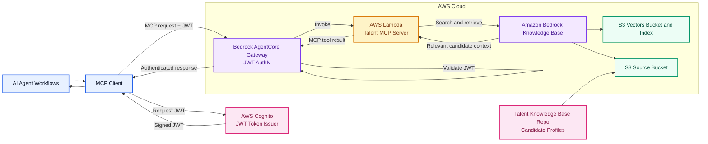

# talent-mcp-server

MCP server for searching the Talent Knowledge Base from agent workflows.

## Use Case

This service lets an AI agent find relevant candidate knowledge without knowing where or how the Talent Knowledge Base is stored.

It exposes MCP tools that are expected to support:

- Semantic search across candidate profiles and talent-related documents.
- Retrieval of the most relevant profile or document details for a given hiring question.
- Integration through AWS Bedrock AgentCore Gateway.

Typical questions this server should help answer:

- "Find candidates with strong GenAI and AWS experience."
- "Retrieve context for this candidate before outreach."
- "Show profiles matching a backend platform engineering role."

## Architecture

This MCP server is intended to act as the agent-facing retrieval layer for the Talent Knowledge Base. Agent clients authenticate with AWS Cognito-issued JWTs, call MCP tools through AWS Bedrock AgentCore Gateway, and the gateway invokes the Lambda-hosted MCP server to route semantic search and retrieval requests to the underlying Bedrock Knowledge Base managed by the `talent-knowledge-base` repository.



The diagram reflects the expected integration boundary for this repository. The Lambda function is the runtime target invoked by Bedrock AgentCore Gateway after Cognito JWT authentication succeeds. Tool schemas, Cognito user pool and app client configuration, Lambda deployment details, AWS Knowledge Base configuration, and candidate profile response contracts still need to be confirmed before MCP handlers are implemented.

## Local Testing

Use MCP Inspector to test the server once implementation and runtime configuration are available:

```bash
npx @modelcontextprotocol/inspector
```

## Status

Tool schemas, AWS Knowledge Base configuration, and candidate profile response contracts must be confirmed before implementing MCP handlers.
